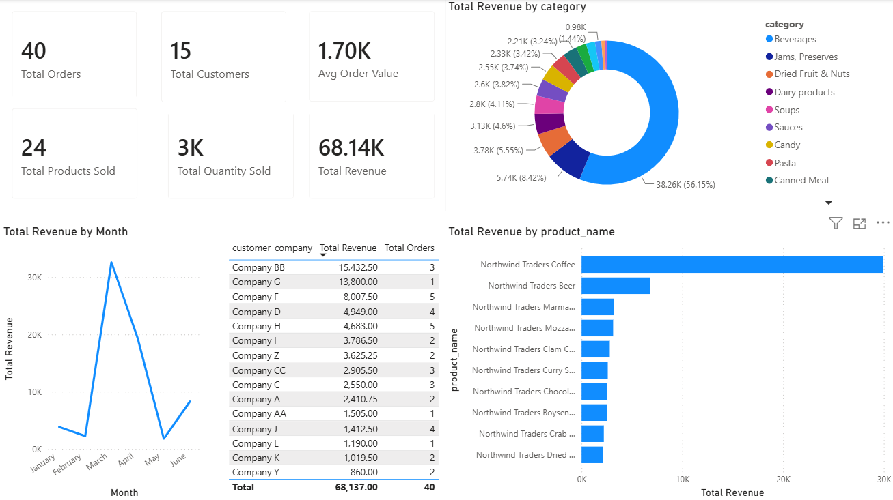

# Retail Sales & Customer Analysis

## Project Overview
Analyzed retail sales data using SQL to identify revenue trends, customer purchasing behavior, product performance, and employee sales effectiveness.

## Tools Used
- MySQL
- Power BI
- Git & GitHub

## SQL Concepts Demonstrated
- Joins
- Aggregations
- CTEs
- Subqueries
- Window Functions
- CASE Statements

## Business Questions Answered
1. Which products generate the highest revenue?
2. Which customers contribute the most revenue?
3. How does revenue change over time?
4. Which employees generate the highest sales?
5. Which customer segments are most valuable?

## Key Insights
- Identified top-performing products by revenue and volume.
- Segmented customers into value tiers.
- Analyzed monthly sales trends.
- Evaluated employee sales performance.

## Dashboard
